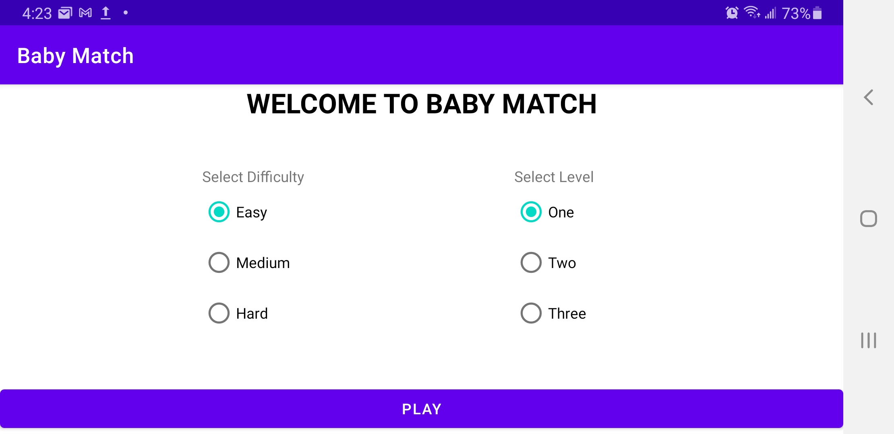
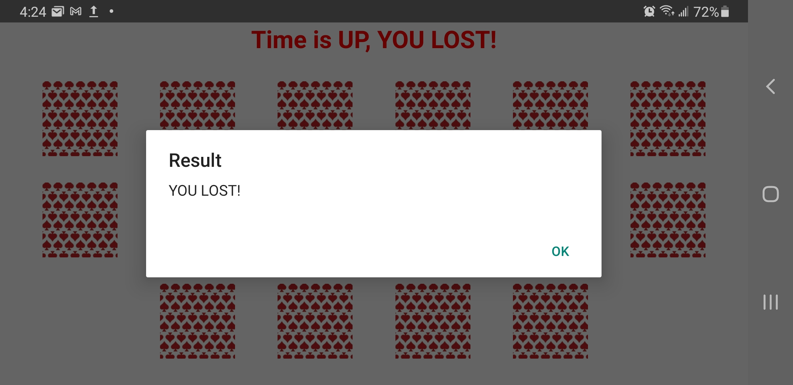
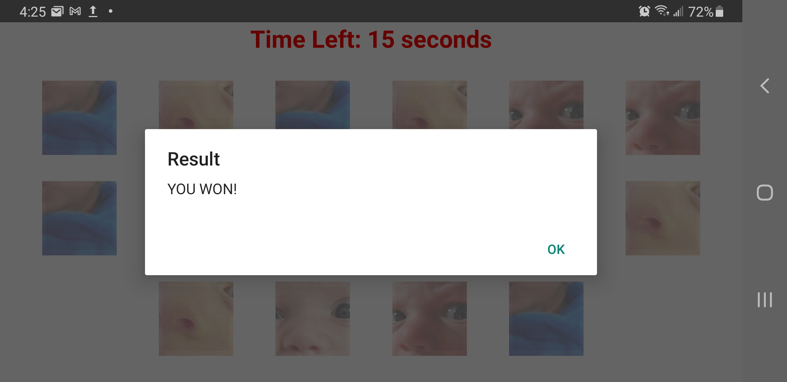
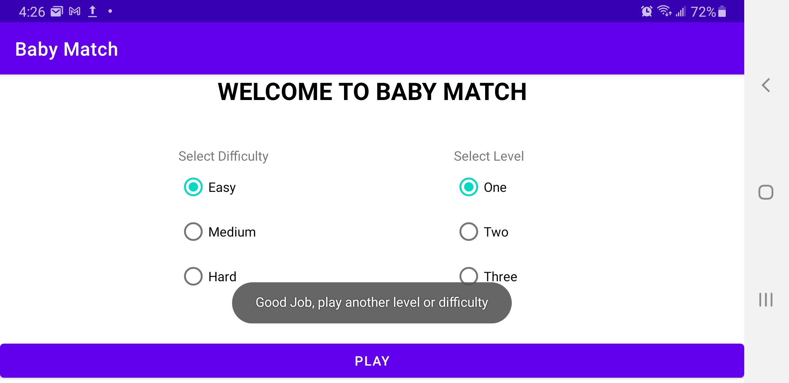
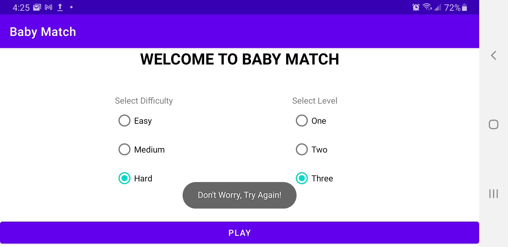

# Baby Match
Baby Match is an android application that I built as a final project for my CS455 course. The application is built by Harpinder Minhas (myself). Baby Match is a memory game application. A grid of cards is shown to the player. Each card in the grid contains a photo of a baby on its flip side. The player flips cards one by one and tries to match the photos of babies within the alloted time period.

## Table of Content

- [System Requirements](#system-Requirements)
- [Permissions required by the application](#Permissions-required-by-the-application)
- [Installation Instructions](#Installation-Instructions)
  - [Allow installation of unknown applications](#Allow-installation-of-unknown-applications)
  - [Download and Install the APK installation file](#Download-and-Install-the-APK-installation-file)
  - [Change the settings back](#Change-the-settings-back)
- [Operating Instructions](#Operating-Instructions)
  - [Welcome Screen](#Welcome-Screen)
  - [Game Screen](#Game-Screen)
  - [Result Screen](#Result-Screen)
  - [Back to Welcome Screen](#Back-to-Welcome-Screen)
- [Design Pattern and list of files](#Design-Pattern-and-list-of-files)
- [Bug List](#Bug-List)
- [Contact Information](#Contact-Information)
- [License and Copyright Information](#License-and-Copyright-Information)
- [References](#References)

## System Requirements
Baby Match runs on devices with Android Operating System. The minimum SDK version required for this application is SDK version 22. The application will run on any android phone or tablet that has SDK version 22 or higher. According to Android Studio more than 92% of all android devices that are connected to the Google Play Store are capable of running Baby Match. Anyone running Android Operating System 5.1 (Android Lollipop) or higher on their device can install the application.

**Note:** The application has only been tested on Android phones. It might not work as expected on other devices.

## Permissions required by the application
Baby Match does not collect any data from the user’s device and therefore does not need permission to access the microphone, camera, contacts, logs, storage etc. No personal information or data is collected from the user’s device.

## Installation Instructions
The application is not available on the Google Play Store therefore the user must install the application through a manual method. The android application pacakage(APK) installation file for this application can be downloaded from the following link:

[Download Baby Match Application](https://drive.google.com/drive/folders/1P4EVQJOAUf1mq2EG9dGYuEnfTw5EU_mj?usp=sharing)

**Following are step by step instructions on how to install Baby Match on your phone:**
- #### Allow installation of unknown applications
  By default, installing unknown apps is not allowed on most android phones because of security reasons. Since this application is not available on Google Play Store, you will need to allow an application such as a browser to download and initiate the installation of unknown apps in order to successfully install Baby Match on your phone.
  The following steps were completed on a Samsung phone running Android 10 but these steps should be similar on other android devices as well.
  
  * Go to Settings and click on Biometrics and security.
    
    
  
  * Click on Install unkown apps.

    
    
  * Select the browser you will be using to download the APK installation file. For example: Samsung Internet.
    
    
    
  * Click on Allow from this source to enable installtion of unknown applications from the selected browser.
    
    
    
- #### Download and Install the APK installation file
  Now you need to use the same browser to download the APK installation file.
  * Open the link and click on the baby_match.apk to start downloading the file.

    
  
  * If a warning is given by Google Drive, please click Download anyway.
  
     
   
  * Once downloading is complete, open the installation file and click Install.

    
   
  * If a warning is given by the Play Store, please click INSTALL ANYWAY.
  
    
  
  * The application will finish installation and you will be given an option to open the application right away or just close the application for now. The application has been successfully installed.
   
    
    
- #### Change the settings back
    It is important that you change the settings back so that the installation of unknown apps is set to not allowed again. Follow the same steps that were used to allow installation of unknown applications in a previous section.
    
## Operating Instructions
- #### Welcome Screen
Upon opening the app, the user is greeted with a welcome screen and a few options to select before playing the game. A player needs to select two things before he/she can play the game: Difficulty and Level.

There are three difficulties to choose from: Easy, Medium and Hard. Depending on the selection, the player gets a time limit to complete the round. 

There are three level to select from: One, Two and Three. Levels decide the amount of cards the player will get on a grid. Level one shows 8 cards, level two presents 12 cards and level three gives the user 16 cards.

The default values for difficulty and level are easy and one respectively. Once the play button is pressed the game begins.

- #### Game Screen
When the play button is clicked the player is shown a grid of cards and a count down timer with the amount of seconds left. All the cards initially face down waiting to be flipped. The player clicks on a card at a time to reveal a photo of a baby on the other side of the card. The player then clicks on a second card to reveal another photo. If the second card has the same photo as the first card, both the cards stay uncovered and the photos fade a little bit to indicate a match has been found, otherwise both cards go back to their original state with their photo sides facing down when the player clicks on a third card.

- #### Result Screen
Once the player finds all the matches or runs out of the given time, the game ends and the player sees a message indicating if he/she won or lost.

 The user needs to click OK to move to another screen.

- #### Back to Welcome Screen
Once the player clicks OK on the result screen, he/she goes back to the welcome screen again. This time their previous selection is the default value for difficulty and level. The player can either play the same round again or choose a different difficulty or level to play a different round.

## Design Pattern and list of files
This application is built following **Model-View-Controller** design pattern. Following are the file that are used in the design pattern.

#### Model
* **BabyCard.kt:**
  This is the model class file that contains data about each card such as is the card flipped?, has the card matched any other card?, and an identifier to identify which baby photo is associated to the card.
  
#### View
* **activity_main.xml**
  This is a view file that shows the user a welcome message and two radio groups with three options each to select difficulty and a level.
  
* **activity_play.xml**
  This file contains a fragment container that is filled by one of the three following fragments: fragment_level_one.xml, fragment_level_two.xml or fragment_level_three.xml.
  
* **fragment_level_one.xml**
  This file contains a text view to show the timer and contains eight image buttons to show a grid of cards.
  
* **fragment_level_two.xml**
  This file contains a text view to show the timer and contains twelve image buttons to show a grid of cards.

* **fragment_level_three.xml**
  This file contains a text view to show the timer and contains sixteen image buttons to show a grid of cards.

#### Controller
* **MainActivity.kt:**
  This file is a controller. It contains the main activity. This file works with the activity_main.xml file and gets the difficulty as well as the level from the user wants to play and starts a new activity.
  
* **PlayActivity.kt:**
  This is also a controller. This file uses the information that is passed to it from the main activity. Depending on the difficulty and level selected by the user this file initiates a fragment and passes it the time user gets to play the game. This file selects the fragment that is used in the fragment container of the activity_play.xml file. From the three different fragments LevelOneFragment.kt,  LevelTwoFragment.kt, and LevelThreeFragment.kt only one is selected by the play activity and is initialized.
  
* **LevelOneFragment.kt:**
LevelOneFragment.kt is initialized by the PlayActivity.kt file. It gets the time a user is allowed to play the game from PlayActivity.kt. It starts a timer as soon as it initializes. It works with the fragment_level_one.xml file to show a grid of 8 cards on the screen. It is also responsible for all the game logic including assigning photos to the model class and changing its properties. The file also checks if the user lost or won and shows the result on screen. Once user confirms the result, it finishes the play activity (PlayActivity.kt) which forces the user back to the main activity.

* **LevelTwoFragment.kt:**
LevelTwoFragment.kt is initialized by the PlayActivity.kt file. It gets the time a user is allowed to play the game from PlayActivity.kt. It starts a timer as soon as it initializes. It works with the fragment_level_two.xml file to show a grid of 12 cards on the screen. It is also responsible for all the game logic including assigning photos to the model class and changing its properties. The file also checks if the user lost or won and shows the result on screen. Once user confirms the result, it finishes the play activity (PlayActivity.kt) which forces the user back to the main activity.

* **LevelThreeFragment.kt:**
LevelThreeFragment.kt is initialized by the PlayActivity.kt file. It gets the time a user is allowed to play the game from PlayActivity.kt. It starts a timer as soon as it initializes. It works with the fragment_level_three.xml file to show a grid of 16 cards on the screen. It is also responsible for all the game logic including assigning photos to the model class and changing its properties. The file also checks if the user lost or won and shows the result on screen. Once user confirms the result, it finishes the play activity (PlayActivity.kt) which forces the user back to the main activity.

  
## Bug List
- #### Enlarged images
The images of babies are becoming large at the run time. A part of the face such as nose, eyes etc are shown instead of the full face of a baby. The photos are zoomed in.

- #### Pressing back button before the game ends
If the back button is pressed before the game ends and the user starts a new game. The previous activity kicks the user out when the game ends. For example: If a user starts a game and presses the back button while 20 seconds are left in the game. When the 20 seconds are up the app will force the user out of the current activity.

## Contact Information
If there are any issues with the game or troubleshooting is needed please contact me through email: hminhas11@gmail.com

## License and Copyright Information
BabyMatch is licensed under the GNU General Public License v3.0 and is available for free.

## References
#### Kotlin documentation
https://kotlinlang.org/docs/android-overview.html

#### Android Studio documentation
https://developer.android.com/docs

#### Code inspiration
https://www.youtube.com/watch?v=U4Wtjewy7EY

https://www.youtube.com/watch?v=E11hTgfsJVY

#### Baby images, card image and license badge
https://i.pinimg.com/originals/18/f2/f7/18f2f7ac0a5a947ac58dc6e77f3e72cb.png

https://i.pinimg.com/originals/36/b1/e9/36b1e90a770ac7c6bdb7617358fa5a21.jpg

https://i2-prod.dailyrecord.co.uk/incoming/article9790424.ece/ALTERNATES/s1227b/Screen-Shot-2017-02-10-at-073529.png

http://clipart-library.com/clip-art/59-592317_faded-spade-100-plastic-poker-playing-cards.htm

https://img.shields.io/badge/License-GPLv3-blue.svg

