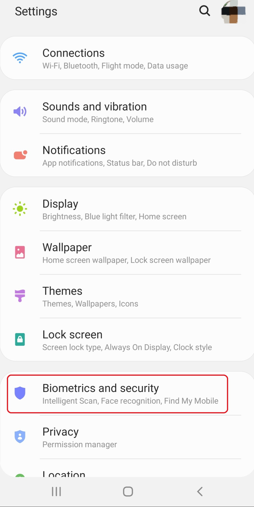
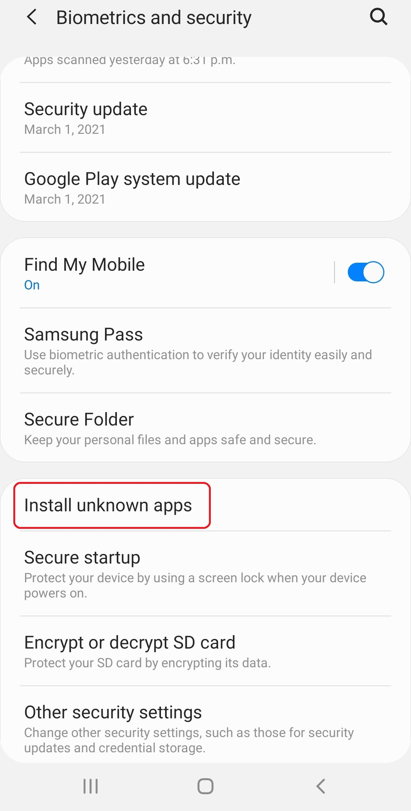
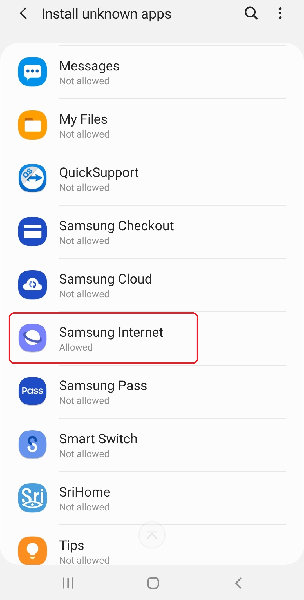
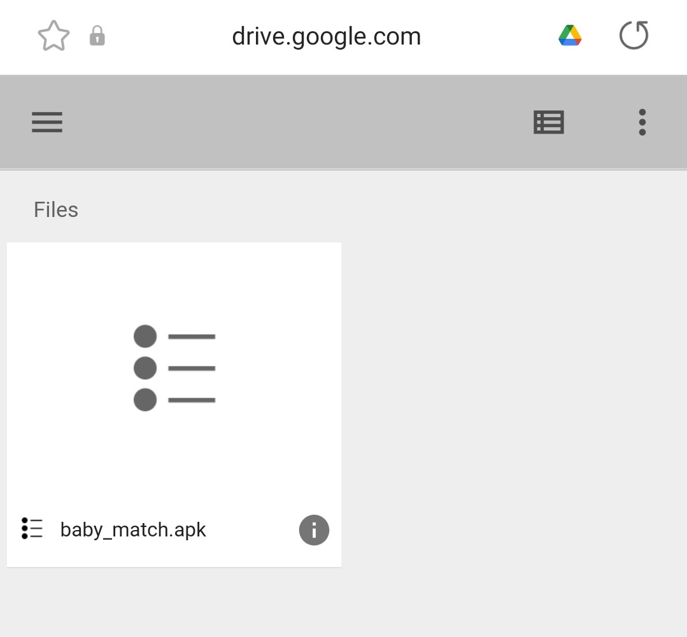
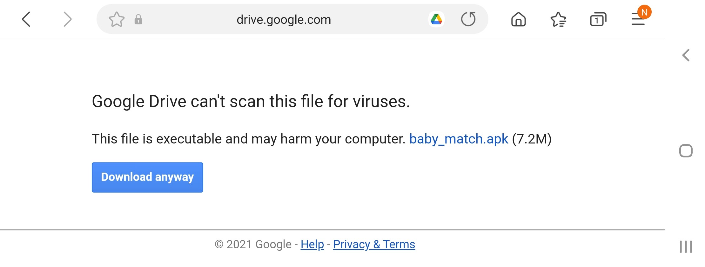
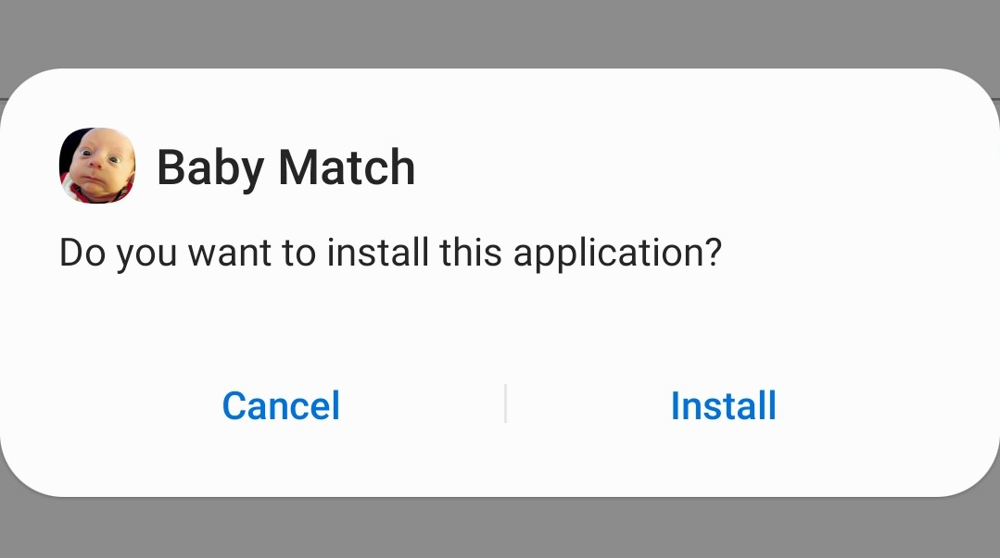
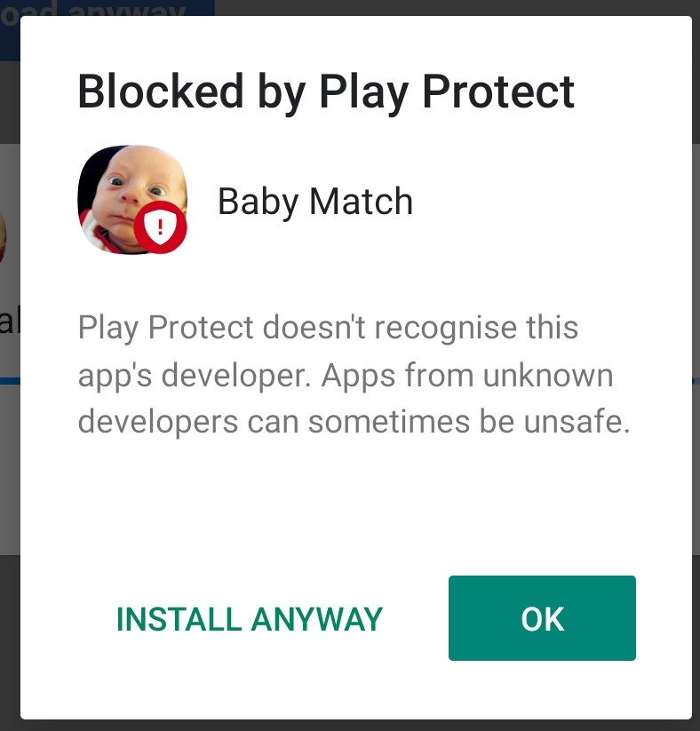
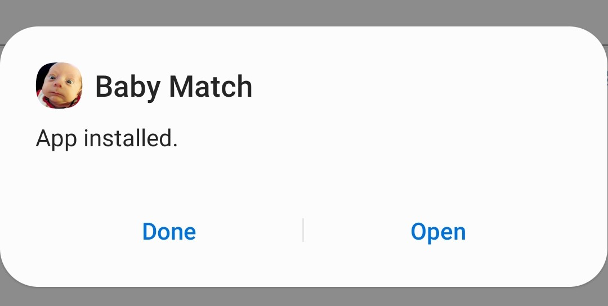

# Baby Match
Baby Match is an android application that I built as a final project for my CS455 course. The application is built by Harpinder Minhas (myself). Baby Match is a memory game application. A grid of cards is shown to the player. Each card in the grid contains a photo of a baby on its flip side.
The player flips cards one by one and tries to match the photos of babies within the alloted time.

## System Requirements
Baby Match runs on devices with Android Operating System. The minimum SDK version required for this application is SDK version 22. The application will run on any android phone or tablet that has SDK version 22 or higher.
According to Android Studio more than 92% of all android phones that are connected to the Google Play Store are capable of running Baby Match.
Anyone running Android Operating System 5.1 (Android Lollipop) or higher on their device can install the application.

## Installation Instructions
The application is not available on the Google Play Store therefore the user must install the application through a manual method.
The android application pacakage(APK) installation file for this application can be downloaded from the following link:

[Download Baby Match Application](https://drive.google.com/drive/folders/1P4EVQJOAUf1mq2EG9dGYuEnfTw5EU_mj?usp=sharing)

**Following are step by step instructions on how to install Baby Match on your phone:**
- #### Allow installation of unknown applications
  By default, installing unknown apps are not allowed to be installed on android phones because of security reasons.
  You will need to allow an application such as a browser to download and initiate the installation of unknown apps in order to successfully install Baby Match on your phone.
  The following steps were completed on a Samsung phone running Android 10 but these steps should be similar on other devices as well.
  
  * Go to Settings and click on Biometrics and security.
    
    
  
  * Click on Install unkown apps.

    
    
  * Select the browser you will be using to download the APK installation file. For example: Samsung Internet.
    
    
    
  * Click on Allow from this source to enable installtion of unknown applications from the selceted browser.
    
    
    
- #### Download and Install the APK installation file.
  Now you need to use the same browser to download the APK installation file.
  * Open the link and click on the baby_match.apk to start downloading the file.

    
  
  * If a warning is given by Google Drive, please accept it.
  
     
   
  * Once downloading is complete, open the installation file and click Install.

    
   
  * If a warning is given by Play Store, please click INSTALL ANYWAY
  
    
  
  * The application will finish installation and you will be given an option to open the application right away or just close with the application for now. The application has been successfully installed.
   
    
## Operating Instsructions 
